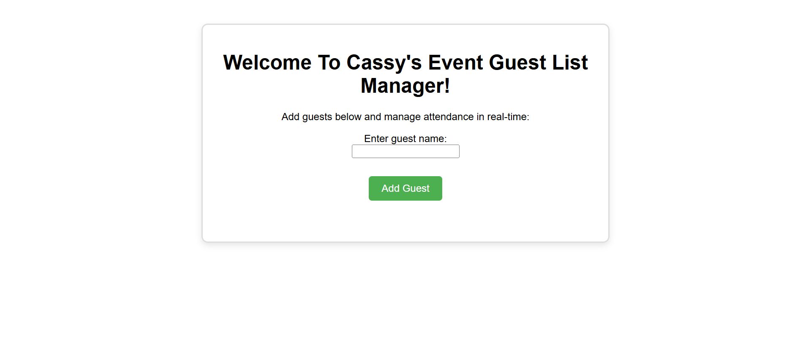

# Event Guest List Manager

Welcome to **Cassy's Event Guest List Manager** — a dynamic and interactive web application that allows you to manage guests for any event in real-time. Add, remove, and track guest RSVPs without reloading the page!


By **Cassy Omondi**

## Description

This project is part of a JavaScript learning module and aims to demonstrate proficiency in:
- DOM selection and manipulation
- Event handling and `preventDefault()`
- Dynamic content rendering
- Form validation and user input control

## Screenshot



## Features

- Add a guest by entering their name into the form
- Display the guest's name on the page upon submission
- Toggle RSVP status between **Attending** and **Not Attending**
- Remove a guest from the list
- Limit the guest list to a maximum of 10 people (with alert)
- Clean and simple user interface
- JavaScript-based form handling (no page reload)

## How to Use

### Requirements
- A computer, phone, or tablet
- A modern web browser (Chrome, Firefox, Edge, Safari)

### View Live Site

Visit the deployed application at: **https://evansveryown.github.io/event-guest-list-manager/**

You can:
- Enter name of guest in the 'guest name' input field
- Press **"Add Guest"** to view the result

### Local Development

If you'd like to run the project locally:

#### 1. Clone the repository:
```bash
git clone https://github.com/evansveryown/event-guest-list-manager.git

Or download the ZIP and extract it.
```

#### 2. Navigate to the project folder:
```bash
cd event-guest-list-manager
```

#### 3. Open index.html in your browser:
You can double-click index.html, or use a live server extension in VS Code and visit http://localhost:5500

 --- 
 
# Author

Cassy Omondi

# License

MIT License

Copyright © 2025 Cassy Omondi

Permission is hereby granted, free of charge, to any person obtaining a copy of this software and associated documentation files (the "Software"), to deal in the Software without restriction, including without limitation the rights to use, copy, modify, merge, publish, distribute, sublicense, and/or sell copies of the Software, and to permit persons to whom the Software is furnished to do so, subject to the following conditions:

The above copyright notice and this permission notice shall be included in all copies or substantial portions of the Software.

THE SOFTWARE IS PROVIDED "AS IS", WITHOUT WARRANTY OF ANY KIND, EXPRESS OR IMPLIED, INCLUDING BUT NOT LIMITED TO THE WARRANTIES OF MERCHANTABILITY, FITNESS FOR A PARTICULAR PURPOSE AND NONINFRINGEMENT. IN NO EVENT SHALL THE AUTHORS OR COPYRIGHT HOLDERS BE LIABLE FOR ANY CLAIM, DAMAGES OR OTHER LIABILITY, WHETHER IN AN ACTION OF CONTRACT, TORT OR OTHERWISE, ARISING FROM, OUT OF OR IN CONNECTION WITH THE SOFTWARE OR THE USE OR OTHER DEALINGS IN THE SOFTWARE.